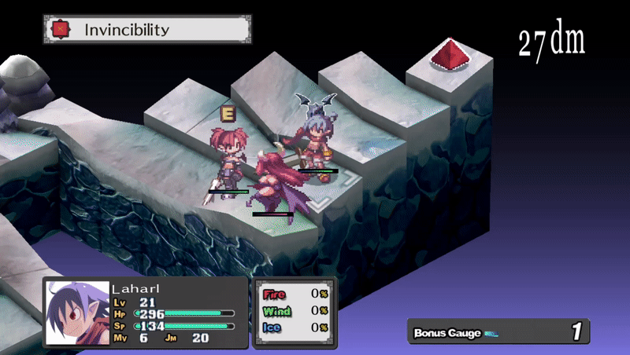

# disgaea 1 (or probably anything) macro generator

Got bored. Find autohotkey useful but kinda hate writing the script. Wanted to do cool stuff like this with one button:


I would rather define keywords like `ATTACK` and `ENDTURN` to map to multiple inputs and generate the script.

Also had a problem with key press duration being too fast for some older games, so I got tired of writing sleep lines between UP DOWN presses.

# define commands

define commands within input.txt

```
; attack only
STARTCOMMAND ^SPACE::
ATTACK
ENDCOMMAND
```
which map a keyword to multiple keystrokes to the mapping dictionary
```
mappings.Add("ATTACK", new List<string>() { "ENTER", "S", "ENTER", "ENTER" });
```
which in turns generates out the auto-hot-key script with delays during the key press
```
^SPACE::
Send, {ENTER down}
sleep, 100
Send, {ENTER up}
sleep, 100
Send, {S down}
sleep, 100
Send, {S up}
sleep, 100
Send, {ENTER down}
sleep, 100
Send, {ENTER up}
sleep, 100
Send, {ENTER down}
sleep, 100
Send, {ENTER up}
sleep, 100
return

```
and in action...



# define complex commands

let's you string together repetitive tasks like..
```
; left rotation
STARTCOMMAND ^A::
UP
ATTACK
DOWN
RIGHT
ATTACK
ENDTURN
ENDCOMMAND
```
